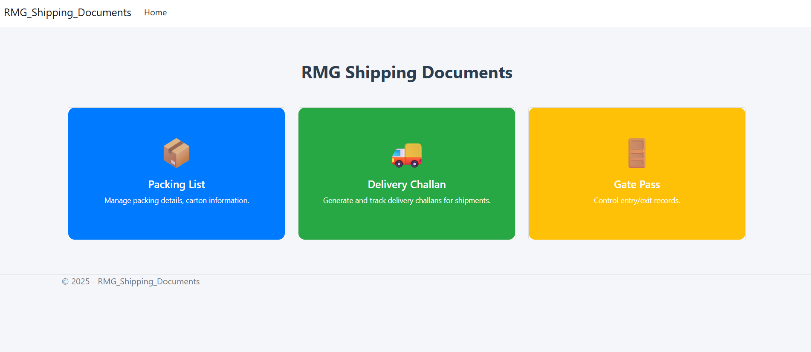

# RMG Shipping Documents

RMG Shipping Documents project build with .NET Core and MVC pattern.
---

## Features

- Feature 1: Packing lists
- Feature 2: Delivery challan
- Feature 3: Gate pass

---

## UI Preview

Screenshots are stored in `wwwroot/images` folder:

### Homepage



---

## Installation instruction

Clone the repository:

```bash
git clone https://github.com/shohagcsediu/RMG-Shipping-Documents.git
```
now edit appsettings.json file and edit Server and Database name, here is example I have used:
```bash
Server=localhost;Database=RMG_DB
```
just create a database on sql server name RMG_DB and then open **db-migration.txt** file and run these sql queries to create table, columns.

Install nuget package I have used on this project is:
- Microsoft Entity framework core
- Microsoft Entity framework core sqlserver
- Microsoft Entity framework core tools
- ClosedXML
- QRCoder

Finally Open in visual studio and install , now run the project. Project will be run on http://localhost:5161/ or similar port on your browser.
